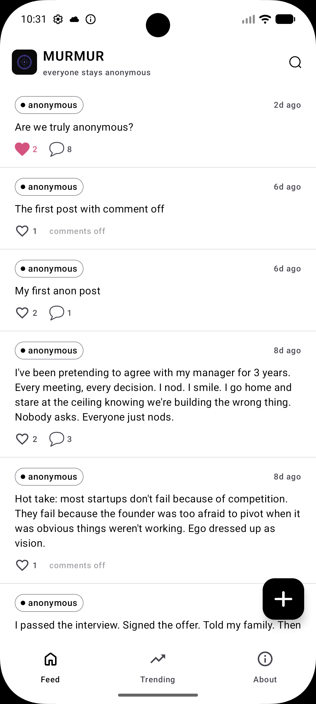
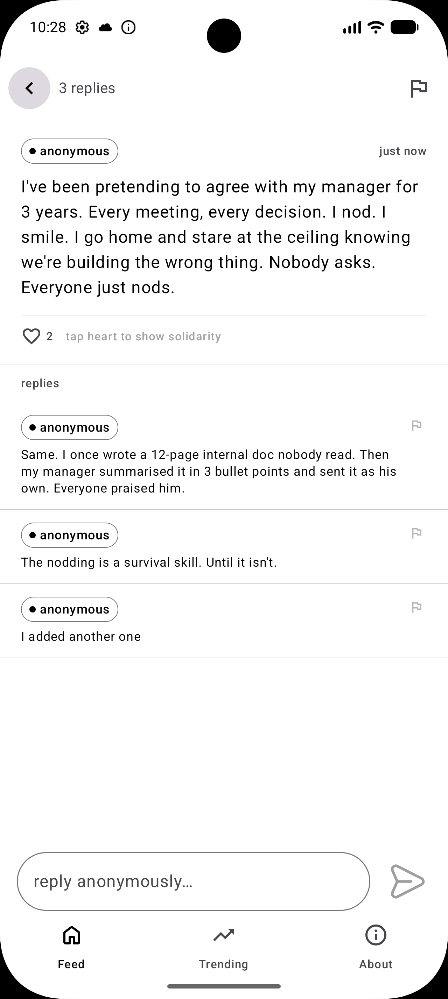

# Murmur

Murmur is a privacy-focused social platform built with **Compose Multiplatform**. It allows users to share thoughts and engage in discussions with a focus on anonymity and device-based identity.

## 📱 Features
- **Anonymous Feed**: Browse and post messages without traditional user accounts.
- **Device-Based Identity**: Uses unique device hashes for moderation and interaction tracking.
- **Real-time Interactions**: Live updates for likes and comments using Supabase Realtime.
- **Moderation**: Built-in reporting system and device-based banning to keep the community safe.
- **Push Notifications**: FCM integration for updates on your posts and interactions.
- **Multiplatform**: Shared core logic and UI between Android and iOS.

## 🛠 Tech Stack
- **UI**: Compose Multiplatform (Material 3)
- **Networking & Backend**: [Supabase](https://supabase.com/) (Postgrest, Realtime, Storage)
- **Dependency Injection**: [Koin](https://insert-koin.io/)
- **Concurrency**: Kotlin Coroutines & Flow
- **Push Notifications**: Firebase Cloud Messaging (FCM)

## 🏗 Project Structure
```
.
├── composeApp/                # Shared Compose Multiplatform code
│   ├── src/
│   │   ├── commonMain/        # Core business logic, UI, and data layer
│   │   ├── androidMain/       # Android-specific implementations (FCM, Services)
│   │   └── iosMain/           # iOS-specific implementations
├── iosApp/                    # iOS Xcode project entry point
└── gradle/                    # Dependency management (Version Catalogs)
```

## 🚀 Getting Started

### Prerequisites
- Android Studio Ladybug or later
- Xcode 15+ (for iOS)
- JDK 17+

### Backend Setup
The project requires a Supabase instance.
1. Create a `push_tokens` table for notifications.
2. Configure Realtime for `posts` and `comments`.
3. Set up your `.env` or configuration with `SUPABASE_URL` and `SUPABASE_KEY`.

### Running the App
- **Android**: Run the `:composeApp` configuration in Android Studio.
- **iOS**: Open `iosApp/iosApp.xcworkspace` in Xcode or run from Android Studio if configured.

## 📸 Screenshots
<p align="center">
  
  
</p>

---
*Built with ❤️ using Kotlin Multiplatform.*
